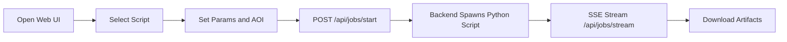

# How-To Guides

This section contains operator-oriented procedures for the most common ili2dgim workflows.

## 1) Run the full managed pipeline from Web UI

Prerequisites:

- Python environment with backend requirements installed.
- Java available in PATH.
- INTERLIS tool binaries available in `ressources/`.

Steps:

1. Start backend server:

```bash
python backend/run_local.py
```

2. Open `http://127.0.0.1:8000`.
3. Choose a pipeline step or direct script.
4. Fill required parameters shown by the dynamic form.
5. Optionally attach AOI flag and geometry.
6. Run and monitor live logs.
7. Download produced artifacts.



## 2) Regenerate DGIF model artifacts only

Use this when you want model/catalog refresh without source ETL.

```bash
python scripts/extract_dgfcd_dgrwi_catalogs.py --output-dir output
python scripts/generate_ili_model.py --output-dir output
python scripts/generate_gpkg.py --output-dir output
```

Expected outputs:

- `output/DGFCD_*.xml`
- `output/DGRWI_RealWorldObjects.xml`
- `output/DGIF_V3.ili`
- `output/DGIF_V3.gpkg`

## 3) Run swissTLM3D ETL into central GeoPackage

1. Open `http://127.0.0.1:8000/settings`.
2. Set destination type to GeoPackage and choose target file path.
3. Set artifact directory.
4. Return to runner page.
5. Execute `etl_swisstlm3d_to_dgif.py` from the script list.

Recommended flags:

- `--output-gpkg` for deterministic target path.
- `--skip-schema` only if schema already exists and you intentionally reuse it.

## 4) Run OFM and Overture ETL

OFM:

```bash
python scripts/etl_ofm_to_dgif.py --ofmx-dir ressources/ofmx_ls/embedded --output-dir output
```

Overture:

```bash
python scripts/etl_overture_to_dgif.py --parquet-dir C:/tmp/overture_parquet --themes buildings,transportation --output-dir output
```

## 5) Build and inspect docs locally

Install:

```bash
pip install -r docs/requirements-docs.txt
```

Serve:

```bash
mkdocs serve
```

Build:

```bash
mkdocs build
```

When the `site/` folder exists, backend exposes docs at `http://127.0.0.1:8000/docs`.