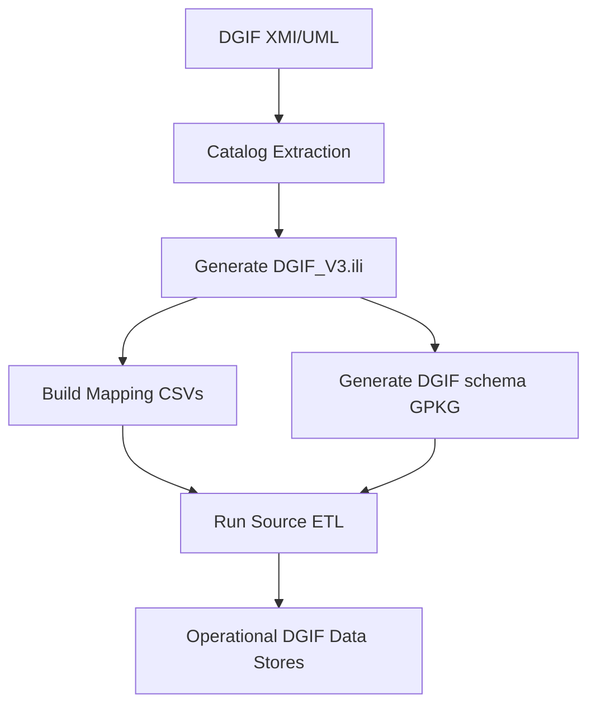

# ili2dgim Principles

## Mission

ili2dgim operationalizes DGIF/DGIM 3.0 in an INTERLIS-first workflow so that conceptual model governance, schema generation, and ETL execution stay aligned.

## Core principles

## 1. Model-first engineering

The source of truth is the UML/XMI model and catalog structures. Scripted transformations derive implementation artifacts, rather than manual database design.

## 2. Standards-based interoperability

The stack combines DGIWG content with Swiss INTERLIS/eCH practices:

- INTERLIS model syntax and compiler validation.
- DGIWG-conformant GeoPackage schema generation.
- Explicit mapping tables from external source taxonomies to DGIF classes.

## 3. Deterministic and repeatable automation

Every step is scriptable and CLI-driven. The same inputs and options should yield consistent outputs across runs.

## 4. Separation of concerns

- Extraction scripts derive catalogs and model artifacts.
- Build scripts create crosswalk/mapping products.
- ETL orchestrators manage source ingestion and target population.
- Transform scripts isolate low-level geometry/attribute loading logic.

## 5. Runtime traceability

The backend records command lines, status transitions, logs, and generated artifacts. Target ingestion can also persist audit metadata for post-run analysis.

## Architecture principles

## Canonical model pipeline

1. Extract DGFCD/DGRWI catalogs from XMI.
2. Generate INTERLIS model.
3. Create DGIF target GeoPackage schema.
4. Generate mapping tables (OSM/swissTLM3D/Overture).
5. Run ETL from selected source into DGIF target storage.

## Controlled target writing

The backend supports one active destination per run (GeoPackage, DuckDB, PostgreSQL settings). Script flags are auto-injected when available:

- `--output-dir`
- `--output-gpkg`
- `--skip-schema` (selectively, for compatible central GeoPackage flows)

## Network and tooling assumptions

- Java is required for INTERLIS toolchain components.
- ETL steps requiring GDAL/OGR assume a compatible Python environment.
- Corporate proxy defaults are applied in backend and certain ETL scripts to stabilize outbound access.

## Design intent for operators

- Operate locally with transparent file outputs.
- Run full pipelines or selected steps.
- Keep AOI and destination settings explicit.
- Preserve traceable logs and downloadable artifacts.