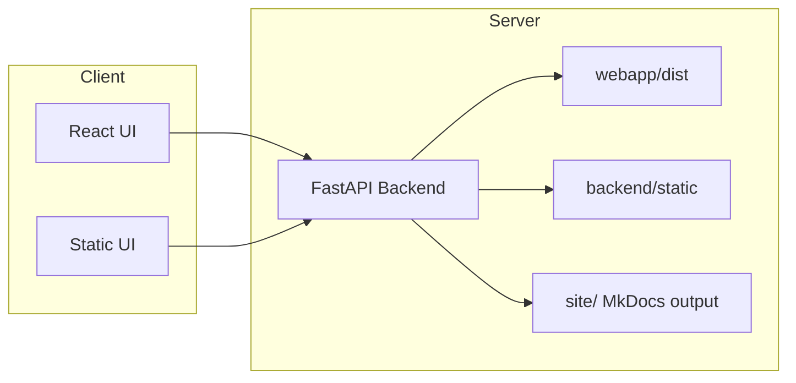

# Webapp Overview

## Runtime modes

The project provides two UI delivery modes:

- React/Vite webapp (`webapp/src`) for modern component-driven UX.
- Static no-npm UI (`backend/static`) served by FastAPI when frontend build tooling is unavailable.

The backend root endpoint serves built frontend assets if present; otherwise it falls back to static pages.



## React webapp architecture

Main files:

- `webapp/src/main.tsx`: React root, Material UI theme bootstrap.
- `webapp/src/App.tsx`: orchestrator screen, script selection, AOI controls, execution log, downloads.
- `webapp/src/api.ts`: typed API client and DTO definitions.
- `webapp/src/components/AoiMap.tsx`: AOI geometry authoring with MapLibre + Mapbox Draw + Turf.

### User flow

1. Fetch script list and script field specs from backend.
2. Render dynamic form fields from parsed CLI options.
3. Collect optional extra args and AOI payload.
4. Start job via backend API.
5. Stream job events through server-sent events and update live log/status.
6. Download generated artifacts from backend links.

### AOI handling

- Supported modes: rectangle, polygon, circle.
- AOI geometry is encoded as GeoJSON polygon in EPSG:4326.
- AOI is only attached to command line if both payload and target CLI flag are provided.

## Static webapp mode

Static pages live in `backend/static`:

- `index.html` + `app.js`: local runner UI.
- `settings.html` + `settings.js`: destination settings.
- `styles.css` + `theme.js`: look and feel + light/dark toggle.

This mode is designed for environments where Node/npm cannot be used locally.

## Docs integration inside webapp

The runner UI and settings UI expose a direct **Docs** entry pointing to `/docs`.

- If MkDocs has been built (`site/` exists), backend serves the documentation site directly.
- If build output is missing, backend serves a fallback docs portal page with instructions.

## Backend orchestration responsibilities

The FastAPI backend (`backend/app/main.py`) provides:

- Script discovery from `scripts/` using a naming allowlist.
- CLI form generation by parsing each script `--help` output.
- Optional override merge from `backend/config/script_overrides.json`.
- Job lifecycle management (start/stream/stop/current state).
- Artifact detection and file download exposure.
- Central destination settings load/save/validate.

## Local run options

## Preferred static mode

```bash
python backend/run_local.py
```

Open:

- `http://127.0.0.1:8000`

## React dev mode (when Node/npm is available)

Backend:

```bash
python backend/run_local.py
```

Frontend (separate terminal):

```bash
cd webapp
npm install
npm run dev
```

Default frontend API base is `http://127.0.0.1:8000` (override with `VITE_API_BASE`).